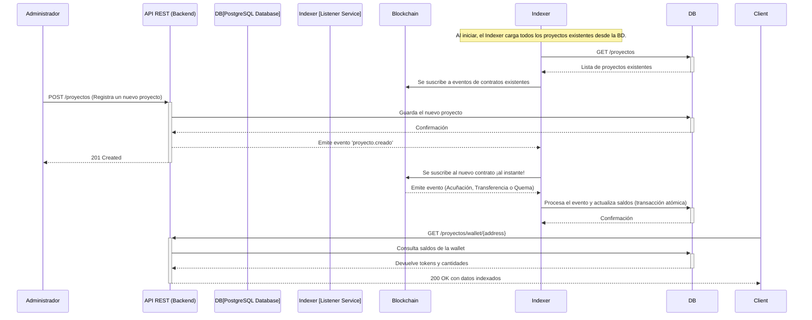

<h1 align="center"><strong>🚀 Rubén D. Guerrero N.</strong></h1>
<h3 align="center">Backend Developer</h3>

## 💡 Sobre mí

- 🔭 Actualmente contribuyo a [Vendure](https://github.com/vendure-ecommerce/vendure), el framework de e-commerce headless en NestJS
- 🌱 Aprendiendo constantemente y metido en el mundo Open Source
- 💬 Me encanta hablar sobre arquitectura escalable, diseño limpio y sistemas distribuidos
- 📫 Contacto: **rudargeneira@gmail.com**

---

## 🚀 Contribuciones destacadas en Open Source

### 🛍️ Vendure – Framework de E-Commerce basado en NestJS

Contribuí al core del proyecto con mejoras técnicas como:

- [`fix(testing): Make e2e test output directory configurable`](https://github.com/vendure-ecommerce/vendure/pull/3723)
- [`fix(core): Prevent circular ref on ShippingMethod serialization`](https://github.com/vendure-ecommerce/vendure/pull/3736)
- [`fix(core): Make payment state transitions idempotent`](https://github.com/vendure-ecommerce/vendure/pull/3734)
- [`feat(core): Add @Override() decorator`](https://github.com/vendure-ecommerce/vendure/pull/3739)

💬 Estas contribuciones recibieron múltiples revisiones por parte de los maintainers y aportan valor real al ecosistema.

## ✨ Frase de cabecera

> “Escribir código es fácil. Escribir código limpio, mantenible y escalable... esa es la verdadera aventura.”

---

## 🚀 Tech Stack y Herramientas

---

## 🌐 Redes y Contacto

---

## 🏆 Proyectos Destacados

# Medical Appointments API

## Descripción

Esta API, desarrollada con NestJS, ofrece una solución completa para la gestión de citas médicas, facilitando la administración de pacientes, médicos y sus respectivas citas en centros de salud. Está dirigida a clínicas, hospitales y consultorios médicos que buscan optimizar la organización y el control de su flujo de pacientes.

## Desarrollador

**Rubén D. Guerrero N.**  
Desarrollador Full Stack  
Email: rudargeneira@gmail.com  
Telegram: @Rubedev

## Tecnologías Utilizadas

- NestJS
- TypeScript
- PostgreSQL
- TypeORM
- Class Validator
- JWT
- Cloudinary (almacenamiento de imágenes)

## Pruebas

- Unitarias: `npm run test`
- E2E: `npm run test:e2e`
- Cobertura: `npm run test:cov`

## Documentación

La documentación completa de la API está disponible a través de Swagger una vez que el servidor está en ejecución.

## Seguridad

- Autenticación mediante JWT
- Validación de datos con Class Validator
- Encriptación de contraseñas
- Configuración CORS

## Funcionalidades Principales

### Gestión de Usuarios (Pacientes, Médicos, Administradores)

La API permite el registro, autenticación y gestión de usuarios con diferentes roles (paciente, médico, administrador). Se utiliza un sistema de roles para controlar los permisos y accesos a las diferentes funcionalidades.

### Creación y Gestión de Citas

Los pacientes pueden solicitar citas con médicos específicos, seleccionando fecha y hora según la disponibilidad del médico. El estado de la cita (confirmada, cancelada, completada) se gestiona a través de un sistema de enums, permitiendo un seguimiento preciso del flujo de la cita.

### Gestión de Historiales Médicos

Se registra el historial médico de cada paciente, incluyendo descripciones, diagnósticos, tratamientos y datos médicos complejos en formato JSONB para facilitar la búsqueda y el análisis.

### Manejo de Recetas Médicas

Integración con la gestión de recetas médicas, incluyendo la lista de medicamentos, indicaciones y la fecha de emisión. Se permite la asociación de recetas a citas específicas y almacenamiento de imágenes mediante Cloudinary.

### Registro de Notas Médicas

Facilita la creación y gestión de notas médicas asociadas a las citas, con la opción de marcarlas como privadas para controlar el acceso a la información sensible.

### Almacenamiento de Documentos de Consulta

Permite subir y gestionar documentos relacionados con las consultas, incluyendo el nombre del archivo, tipo de documento, URL del archivo y la fecha de subida.

### Manejo de Horarios Médicos

Se gestionan los horarios de disponibilidad de los médicos utilizando un formato JSONB para representar la complejidad de los horarios.

# Bot de Telegram para Citas Médicas

## Características Principales

El bot de Telegram [@CitasMedicbot](https://t.me/CitasMedicbot) complementa nuestra API de citas médicas, ofreciendo una interfaz conversacional accesible y fácil de usar para los pacientes.

### Funcionalidades Implementadas

- **Menú Interactivo**: Navegación intuitiva mediante botones y comandos
- **Búsqueda de Farmacias**: Localiza farmacias cercanas basadas en la ubicación del usuario
- **Búsqueda de Centros Médicos**: Encuentra centros médicos cercanos con opciones para obtener direcciones
- **Consultas Médicas por IA**: Responde preguntas médicas básicas utilizando inteligencia artificial
- **Recordatorios de Medicamentos**: Configura y gestiona recordatorios para tomar medicamentos
- **Información de Contacto**: Acceso rápido a información de contacto del centro médico
- **Gestión de Historial Médico**: Registro y consulta de historiales médicos personales
  - Creación de nuevos registros médicos con diagnósticos, tratamientos y médicos
  - Visualización detallada del historial médico completo
  - Eliminación de registros médicos específicos
  - Interfaz intuitiva con botones interactivos para navegar entre opciones
  - **Exportación de Recordatorios Médicos**: Genera y descarga reportes de medicamentos en formato PDF o CSV
  - Exportación personalizada con datos del paciente
  - Opción para compartir directamente con profesionales médicos
  - Formato profesional para uso clínico
  - Resumen estadístico de medicamentos y frecuencias
- **Recordatorios de Citas Médicas**: Configuración y gestión de recordatorios para citas médicas programadas
- **Integración con Geolocalización**: Búsqueda de servicios médicos basada en la ubicación actual del usuario
- **Interpretación de Resultados de Laboratorio**: Procesamiento automático de resultados de laboratorio y visualización en formato texto
**Informacion de Emergencia Médica**: 
 Permite a los usuarios configurar y almacenar datos médicos críticos (como alergias, condiciones preexistentes, medicamentos actuales),Tipo de Sangre, Factor,contacto de emergencia (Nombre y Numeros telefonicos ), a demás si el usuario posee una Póliza de Seguro Médico,. Esta información es vital para situaciones de primeros auxilios y se puede generar un código de acceso para que personal médico autorizado la consulte rápidamente."
 **Genera Código QR**:
 Con tu Información Médica en caso de que necesites Primeros Auxilios, al escanearlo las personas o el personal médico que te presten primeros auxilios podran saber de tus alergias, tratamientos, si posees o no Seguro Médico, Nombre de la Compañía , Nombre y Número de Telefono de la Persona de Contacto

### Próximas Funcionalidades

#### 1. Sistema de Citas Médicas

- Programación, visualización y cancelación de citas médicas directamente desde Telegram
- Recordatorios automáticos de citas próximas
- Opción para reprogramar citas con un simple botón

#### 2. Seguimiento de Medicamentos Mejorado

- Registro de medicamentos con fotos (el usuario puede enviar una foto del medicamento)
- Alertas de interacciones medicamentosas peligrosas
- Recordatorios personalizables (sonidos, frecuencia, mensajes)

#### 3. Síntomas y Primeros Auxilios

- Guía interactiva de primeros auxilios con imágenes y videos
- Evaluador de síntomas básico que sugiera nivel de urgencia
- Información sobre cuándo buscar atención médica inmediata

#### 4. Integración con Seguros Médicos

- Verificación de cobertura de seguro para clínicas y farmacias mostradas
- Consulta de saldo disponible o estado de reembolsos
- Información sobre trámites y documentación necesaria

#### 5. Comunidad y Soporte

- Grupos de apoyo para condiciones específicas
- Conexión con otros pacientes (anónima y moderada)
- Preguntas frecuentes sobre condiciones médicas comunes

#### 6. Telemedicina

- Integración con servicios de consulta médica virtual
- Programación de videoconsultas desde el bot
- Sala de espera virtual con notificaciones

#### 7. Gamificación para Adherencia al Tratamiento

- Sistema de puntos por seguir tratamientos correctamente
- Insignias y logros por mantener hábitos saludables
- Estadísticas visuales de progreso

---

>
  <h1>Bot Taurino para Telegram con NestJS y Gemini</h1>

Este proyecto es un bot de Telegram inteligente, desarrollado con **NestJS**, que actúa como un asistente virtual para aficionados a la tauromaquia. El bot es capaz de comprender el lenguaje natural gracias a la **API de Gemini** y extrae información actualizada sobre los próximos festejos televisados mediante web scraping del portal **"El Muletazo"**.

---

## 📜 Tv Taurina en España

El objetivo principal de este bot es ser el asistente de referencia para los aficionados taurinos, proporcionando una forma rápida y conversacional de consultar tanto la **agenda de festejos televisados** como el **calendario completo de la temporada taurina**. El bot combina la robustez de un backend en NestJS con la inteligencia artificial de Google Gemini para ofrecer una experiencia de usuario fluida e inteligente.

El bot es capaz de mantener conversaciones con contexto, recordar interacciones previas con el usuario, realizar búsquedas específicas más allá de la información general obtenida por web scraping y guiar al usuario a través de diálogos interactivos para filtrar información.

### ✨ Características Principales

- **Procesamiento de Lenguaje Natural (NLP)**: Utiliza el modelo `gemini-2.0-flash` para interpretar una amplia gama de solicitudes en lenguaje coloquial (ej: "quiero ver toros", "¿qué corridas televisan?"), responder preguntas generales sobre tauromaquia y realizar búsquedas específicas.
- **Web Scraping Dual**:
  - **Festejos Televisados**: Extrae la agenda de "El Muletazo" usando `axios` y `cheerio` para obtener información sobre las transmisiones.
  - **Calendario Taurino**: Realiza scraping de "Servitoro" usando `Puppeteer` para obtener el calendario completo de la temporada, manejando contenido cargado dinámicamente.
- **Sistema de Caché Avanzado**: Implementa un sistema de caché independiente para cada fuente de datos (El Muletazo y Servitoro), optimizando el rendimiento, reduciendo las peticiones a los sitios web y ofreciendo respuestas instantáneas.
- **Conversación Persistente con Gestión de Sesiones**: Utiliza `telegraf/session` para recordar el historial de chat de cada usuario, evitando saludos repetitivos y permitiendo conversaciones fluidas y con contexto.
- **Filtrado Interactivo con Telegraf Scenes**: Guía al usuario a través de diálogos de varios pasos para filtrar tanto las transmisiones (por mes, por canal) como el calendario taurino (por mes, ciudad, etc.).
- **Reconocimiento de Lenguaje Natural**: Entiende una gran variedad de frases coloquiales (ej: "agenda de festejos", "muéstrame el calendario", "¿quién hizo este bot?") para activar funcionalidades sin necesidad de usar comandos.
- **Flujo de Conversación Robusto**: Gestiona el estado de la conversación de forma inteligente, permitiendo al usuario salir de una función (como el calendario) y continuar con otra sin errores ni comportamientos inesperados.
- **Interfaz de Usuario Dinámica**: Personaliza los botones de los canales de transmisión con nombres descriptivos (ej: "Canal Sur", "T.Madrid") extraídos directamente de las URLs.
- **Guía Proactiva al Usuario**: El mensaje de bienvenida (`/start`) ahora presenta claramente los servicios disponibles y sugiere frases en lenguaje natural para interactuar, mejorando la experiencia inicial del usuario.
- **Comandos Directos**: Incluye comandos como `/transmisiones`, `/calendario` y `/contacto` para un acceso rápido, además de comandos de administración como `/clearcache`.

---

### 🌱 Sustainable Credits Indexer

Desarrollé el **Sustainable Credits Indexer**, un robusto servicio de backend que actúa como puente de datos entre la blockchain y aplicaciones convencionales. Indexa *off-chain* eventos de contratos inteligentes **ERC-1155** que representan **Activos del Mundo Real (RWA)** —como créditos de carbono, biodiversidad o reciclaje— para ofrecer acceso rápido, seguro y eficiente a estos datos.

#### 🔍 Uso y Alcance para la Sociedad

- **Para Empresas y Organizaciones**:  
  Permite gestionar y consultar saldos de créditos de sostenibilidad de forma instantánea mediante apps web/móvil, sin interactuar directamente con la blockchain (lento y costoso). Ideal para entidades en mercados de carbono, reforestación o reciclaje.

- **Para Desarrolladores y Nuevos Mercados**:  
  Ofrece una **API RESTful simple** para construir mercados verdes, portafolios de inversión o dashboards ambientales sin necesidad de experiencia en blockchain, fomentando la innovación en la economía verde.

- **Para Reguladores y Auditores**:  
  Proporciona una fuente de datos centralizada, íntegra y en tiempo real que refleja fielmente la blockchain, facilitando auditorías y verificación de propiedad (con posibilidad de anclar documentación a IPFS).

#### 🌟 Beneficios Clave

- **Eficiencia radical**: Consultas instantáneas gracias al indexado en PostgreSQL (vs. llamadas lentas a la blockchain).
- **Integridad garantizada**: Operaciones atómicas y lógica precisa para Mint/Transfer/Burn, evitando inconsistencias.
- **Escalabilidad dinámica**: Nuevos proyectos se registran vía `POST /proyectos` y son descubiertos automáticamente sin reiniciar el servicio.
- **Democratización Web3**: Desarrolladores Web2 pueden construir sobre infraestructura blockchain sin curva de aprendizaje pronunciada.

#### 🛠️ Stack Tecnológico

NestJS, TypeScript (96.5%), PostgreSQL (con Docker), TypeORM, Ethers.js, Git/GitHub.

---

### 🎳 Bowling Tournament Management System (2024)

Plataforma web para organizar torneos de bolos: registro de equipos y jugadores, seguimiento en tiempo real, generación de brackets y reglas personalizadas.

**Stack:** Node.js, NestJS, PostgreSQL

[🔗 Ver Repositorio](#) | [🎮 Demo](#)

---

### 🛒 Shopping Cart System (2024)

Sistema de carrito de compras para e-commerce con gestión de productos, autenticación, manejo de carrito y procesamiento de pedidos.

**Stack:** Node.js, NestJS, PostgreSQL

[🔗 Ver Repositorio](#) | [🛍️ Demo](#)

---

### 🎡 Amusement Park API

API RESTful para la gestión de parques de diversiones, clientes, empleados, atracciones, tickets y promociones con estadísticas en tiempo real.

- Gestión de clientes y personal.
- Compra de tickets y control de acceso.
- Promociones y analítica de visitas.

**Stack:** NestJS, TypeORM, PostgreSQL, TypeScript

---

## 📊 GitHub Stats

---

## ✨ ¿Colaboramos?

Siempre estoy abierto a nuevos desafíos, proyectos colaborativos y oportunidades profesionales.  
¡Contáctame y creemos algo extraordinario juntos!

<!--
Proudly created with Copilot & GPRM (https://gprm.itsvg.in)
-->
