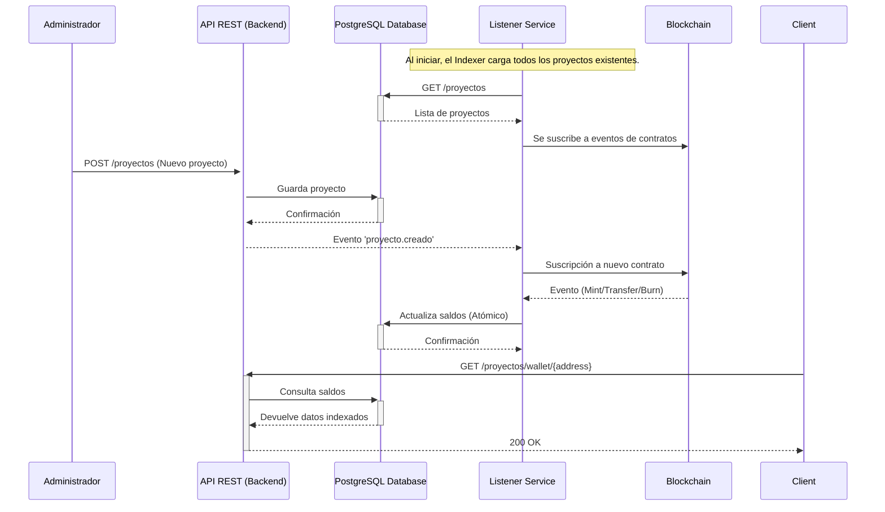

  

  

  
  
  
  
  

 

## ⚡ Sobre mí

> "Escribir código es fácil. Escribir código limpio, mantenible y escalable... esa es la verdadera aventura."

Soy un desarrollador apasionado por la **arquitectura escalable**, el **diseño limpio** y los **sistemas distribuidos**. Actualmente, dedico gran parte de mi tiempo al Open Source.

- 🔭 Contribuidor activo en **[Vendure](https://github.com/vendure-ecommerce/vendure)** (e-commerce headless en NestJS).
- 🌱 Siempre aprendiendo nuevas tecnologías y patrones de diseño.
- 💬 Hablemos sobre **NestJS**, **Microservicios** y **Clean Architecture**.

---

  <h3>🛠️ Tech Stack</h3>
  
  
  
  
  
  
  
  
  
  
  
  
  

---

## 🚀 Contribuciones Open Source

### 🛍️ [Vendure](https://github.com/vendure-ecommerce/vendure)
Aportes significativos al core del framework:
- [`fix(testing)`](https://github.com/vendure-ecommerce/vendure/pull/3723): Make e2e test output directory configurable
- [`fix(core)`](https://github.com/vendure-ecommerce/vendure/pull/3736): Prevent circular ref on ShippingMethod serialization
- [`fix(core)`](https://github.com/vendure-ecommerce/vendure/pull/3734): Make payment state transitions idempotent
- [`feat(core)`](https://github.com/vendure-ecommerce/vendure/pull/3739): Add `@Override()` decorator

---

## 🏆 Proyectos Destacados

### 🟢 [Sustainable Credits Indexer](#)
*Servicio Backend para RWA (Real World Assets)*

> Indexador off-chain de eventos ERC-1155 para créditos de carbono, diseñado para empresas y reguladores que necesitan auditoría en tiempo real sin los costos de la blockchain.

- **Stack**: NestJS, PostgreSQL, Ethers.js, Blockchain

#### 🔍 Características
- **Eficiencia radical**: Consultas instantáneas (PostgreSQL) vs. llamadas lentas a blockchain.
- **Integridad**: Operaciones atómicas para Mint/Transfer/Burn.
- **Escalabilidad**: Descubrimiento automático de nuevos contratos de proyectos.

#### 📐 Diagrama de Arquitectura (Mermaid)

---

### 🏥 Medical Appointments API
*Sistema Integral de Gestión Clínica*

API completa desarrollada en **NestJS** para la administración de clínicas. Permite la gestión de pacientes, médicos, citas y recetas con altos estándares de seguridad y rendimiento.

**Tecnologías:** NestJS, TypeScript, PostgreSQL (TypeORM), JWT, Cloudinary.

#### ✨ Funcionalidades Clave
- **Roles y Permisos**: Sistema granular (Admin, Médico, Paciente).
- **Gestión de Citas**: Flujo completo (solicitud, confirmación, cancelación).
- **Historial Médico**: Almacenamiento JSONB de diagnósticos complejos.
- **Recetas e Imágenes**: Subida de evidencias y recetas a la nube.
- **Seguridad**: Autenticación JWT y validación estricta de datos.

> **Documentación**: Disponible vía Swagger en el despliegue.

---

### 🐂 Bot Taurino con IA (Telegram)
*Asistente inteligente con NestJS y Gemini*

Un bot avanzado que combina **Web Scraping** e **Inteligencia Artificial** para informar a los aficionados taurinos.

**Tecnologías:** NestJS, Gemini API, Telegraf, Puppeteer, Cheerio, Redis (Caché).

#### 🚀 Capacidades
- **NLP Avanzado (Gemini)**: Entiende lenguaje natural como "quiero ver toros hoy" o "¿qué televisan el domingo?".
- **Scraping Dual**: Extrae datos de transmisión (El Muletazo) y calendarios (Servitoro).
- **Caché Inteligente**: Respuestas instantáneas y reducción de carga al servidor origen.
- **Persistencia**: Recuerda el contexto de la conversación.

---

### 🩺 Bot de Telegram para Citas Médicas
*Interfaz conversacional para pacientes*

Extensión de la API de Citas Médicas que acerca los servicios al paciente a través de Telegram.

#### 💡 Funcionalidades Implementadas
- **Geolocalización**: Encuentra farmacias y centros médicos cercanos.
- **Gestión de Historial**: Consulta y creación de nuevos registros.
- **Recordatorios**: Alertas para toma de medicamentos.
- **Código QR de Emergencia**: Generación de QR con datos vitales (alergias, tipo de sangre) para primeros auxilios.

---

### 📂 Otros Proyectos

#### 🎳 Bowling Tournament Management
Plataforma web para torneos de bolos, brackets y seguimiento en tiempo real.
- **Stack**: Node.js, NestJS, PostgreSQL

#### 🛒 Shopping Cart System
Backend para e-commerce con lógica de carritos y pedidos.
- **Stack**: Node.js, NestJS, PostgreSQL

#### 🎡 Amusement Park API
API RESTful para gestión de parques (tickets, atracciones, empleados).
- **Stack**: NestJS, TypeORM, PostgreSQL

---

<!--

  <h3>📊 GitHub Stats</h3>
   
  
  
  
  
   
  
  

-->

   
  

